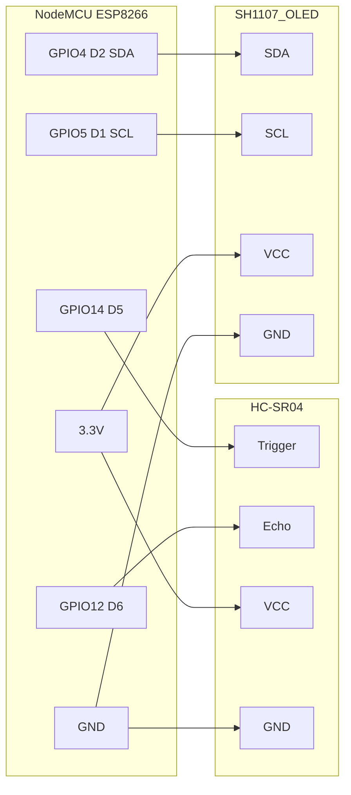

# Monitor de Nível de Tanque

Sistema de monitoramento de nível de líquido em tanques usando **NodeMCU ESP8266**, sensor ultrassônico HC-SR04 e display OLED **SH1107 128×128** (modelo MC01506 1.5").

## Características

- Leitura precisa de distância com sensor HC-SR04
- Conversão automática de distância para nível percentual
- Display OLED SH1107 128×128 com interface gráfica
- Barra visual de nível em tempo real
- Sistema de alertas (Crítico, Baixo, Médio, Alto)
- Monitoramento via Serial Monitor (115200 baud)
- Média de múltiplas leituras para maior precisão

## Hardware Necessário

| Componente | Especificação |
|------------|---------------|
| **Microcontrolador** | NodeMCU ESP8266 |
| **Sensor Ultrassônico** | HC-SR04 |
| **Display OLED** | MC01506 1.5" SH1107 128×128 I2C |
| **Cabos** | Jumpers macho-fêmea |

## Diagrama de Conexões



### Tabela de Pinos

| Componente | Pino Display | Pino NodeMCU | GPIO |
|-----------|-------------|-------------|------|
| **HC-SR04 Trigger** | Trigger | **D5** | GPIO14 |
| **HC-SR04 Echo** | Echo | **D6** | GPIO12 |
| **Display SDA** | SDA | **D2** | GPIO4  |
| **Display SCL** | SCL | **D1** | GPIO5  |
| **Alimentação** | VCC | 3.3V | - |
| **GND** | GND | GND | - |

## Instalação

### 1. Configurar PlatformIO

```ini
[env:nodemcuv2]
platform = espressif8266
board = nodemcuv2
framework = arduino
monitor_speed = 115200

lib_deps =
    adafruit/Adafruit SH110X @ ^2.1.11
    adafruit/Adafruit GFX Library @ ^1.11.9
```

### 2. Compilar e fazer upload

```bash
pio run --target upload
```

### 3. Monitor serial

```bash
pio device monitor -p /dev/ttyUSB0 -b 115200
```

## Configuração (`include/config.h`)

```cpp
// HC-SR04
#define TRIG_PIN 14      // GPIO14 = D5
#define ECHO_PIN 12      // GPIO12 = D6

// Display SH1107
#define SCREEN_WIDTH 128
#define SCREEN_HEIGHT 128
#define OLED_RESET -1
#define SCREEN_ADDRESS 0x3C
#define PIN_SDA 4        // GPIO4 = D2
#define PIN_SCL 5        // GPIO5 = D1

// Tanque
#define ALTURA_TANQUE 200
#define DISTANCIA_SENSOR 10

// Leituras
#define NUM_LEITURAS 5
#define INTERVALO_LEITURA 100
#define TIMEOUT_SENSOR 30000
#define INTERVALO_ATUALIZACAO 500

// Alertas
#define NIVEL_CRITICO 10
#define NIVEL_BAIXO 25
#define NIVEL_MEDIO 50
#define NIVEL_ALTO 75
```

## Painel Web (Modo AP)

O ESP8266 cria uma rede Wi-Fi própria (Access Point) com um painel de monitoramento web.

### Acesso

| Item | Valor |
|------|-------|
| **Rede Wi-Fi** | `Monitor-Nivel` |
| **Senha** | `12345678` |
| **URL do painel** | `http://192.168.4.1` |
| **Tipo** | Access Point (DHCP para clientes) |

### Como Conectar

1. No celular ou notebook, conecte-se à rede Wi-Fi **`Monitor-Nivel`** (senha: `12345678`)
2. Abra o navegador e acesse **`http://192.168.4.1`**
3. O painel web mostrará automaticamente:

```
┌──────────────────────────────────┐
│        MONITOR DE NÍVEL          │
│        ──── ∙ ────               │
│                                  │
│          ╭──────────╮            │
│          │  ╭────╮  │  ← Gauge   │
│          │  │ 87%│  │    animado  │
│          │  ╰────╯  │            │
│          ╰──────────╯            │
│                                  │
│   ┌──────────┐ ┌──────────┐      │
│   │ Nível    │ │ Distância│      │
│   │ 175.0 cm │ │ 35.0 cm  │      │
│   └──────────┘ └──────────┘      │
│                                  │
│   ┌──────────────────────────┐   │
│   │ Histórico                │   │
│   │   ╱╲    ╱╲               │   │
│   │  ╱  ╲  ╱  ╲              │   │
│   │ ╱    ╲╱    ╲             │   │
│   └──────────────────────────┘   │
└──────────────────────────────────┘
```

### Funcionalidades do Painel

- **Gauge**: arco gradiente com animação suave do percentual
- **Status**: badge colorido (verde = OK, amarelo = baixo, vermelho = crítico)
- **Cards**: nível em centímetros e distância do sensor
- **Gráfico**: histórico das últimas 60 leituras em tempo real
- **Auto-update**: dados atualizados a cada 1,5 segundos via AJAX

### Tela de Inicialização

Durante o boot, o display OLED mostra uma tela de boas-vindas com:
- Nome da rede e senha
- IP do servidor web (`192.168.4.1`)
- Barra de progresso animada (5 segundos)

Após a inicialização, o display entra no modo de monitoramento normal.

## Detalhes Técnicos

### Driver do Display SH1107

O display MC01506 1.5" utiliza o driver **SH1107** com resolução **128×128**. O construtor da biblioteca Adafruit SH110X **requer os parâmetros (HEIGHT, WIDTH) nesta ordem específica**:

```cpp
Adafruit_SH1107 display = Adafruit_SH1107(SCREEN_HEIGHT, SCREEN_WIDTH, &Wire, OLED_RESET);
//                                          ^^^^           ^^^
//                                          ALTURA primeiro, depois LARGURA
```

### I2C

- **Endereço**: `0x3C` (confirmado via scanner)
- **Clock**: 100 kHz (reduzido de 400 kHz para maior estabilidade no ESP8266)
- **Pinos**: SDA = GPIO4 (D2), SCL = GPIO5 (D1)

### Tratamento de Erros

- Falha de inicialização do display → loop infinito com mensagem serial
- Leitura inválida do sensor → ignorada, mantém último valor válido
- Média de 5 leituras para filtrar ruído do HC-SR04

## Saída Serial

```
Monitor Tanque v6.0 - SH1107 OK!
Display OK!
Pronto!

Dist: 102.12 | Nivel: 107.88 (54%)
Dist: 23.38 | Nivel: 186.62 (93%)
```

## Interface do Display

```
┌─────────────────────────────┐
│ MONITOR DE NIVEL            │
├─────────────────────────────┤
│ 87%                    ████ │
│                        ████ │
│                        ████ │
│ Nivel: 175.0 cm        ████ │
│ Dist: 35.0 cm          ████ │
│ Status: ALTO           ████ │
└─────────────────────────────┘
```
